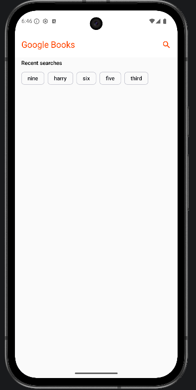
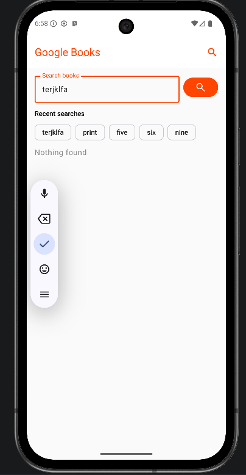
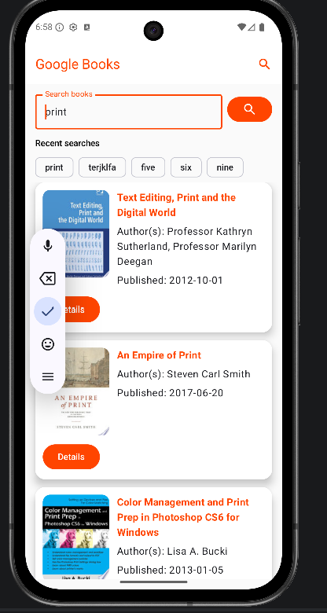
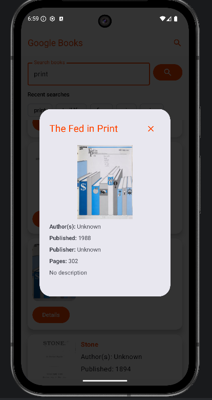

# Google Books App

Android application for searching books using the Google Books API.

## Features

- Search books by keyword
- Display search results (title, author, publication date)
- Book details view (description, publisher, page count)
- Recent search history (up to 5 entries)
- Quick repeat search using recent queries

## Architecture and Technologies

The app follows the MVVM architecture.

Technologies used:

- Kotlin
- Jetpack Compose
- ViewModel
- StateFlow
- Repository pattern
- Retrofit
- Gson
- Coroutines
- Material 3

Layered structure:

- UI (Compose)
- ViewModel
- Repository
- Data layer (remote/local)

## Search History

- Stores the latest 5 queries
- Removes duplicates
- Allows re-running a query by tapping history chips

## Missing Data Handling

The app handles incomplete API data gracefully:

- if a book has no cover image, it shows "No Image"
- if description is missing, it shows "No description"
- if author/publisher/date/page count is missing, it shows "Unknown" or "-"

## User Interface

- Search field
- Books list (LazyColumn)
- Book cards
- Details button
- Details dialog
- Recent searches block (chips)

## Project Structure

```text
app/src/main/java/com/example/googlebooks/
├── data/
│   ├── local/
│   ├── remote/
│   └── repository/
├── domain/
│   └── model/
├── ui/
│   └── theme/
└── viewModel/
    └── search/
```

## How to Run

1. Open the project in Android Studio
2. Wait for Gradle Sync to finish
3. Start an emulator or connect a physical Android device
4. Click Run
5. Enter a search query

## Screenshots

### Main Screen


### Search Results




### Book Details


## Notes

- Internet connection is required for online search
- If Google API returns `429 (quota exceeded)`, retry later
- If local data behaves unexpectedly during testing, clear app data on emulator

## Author

Nadezda Artamonova